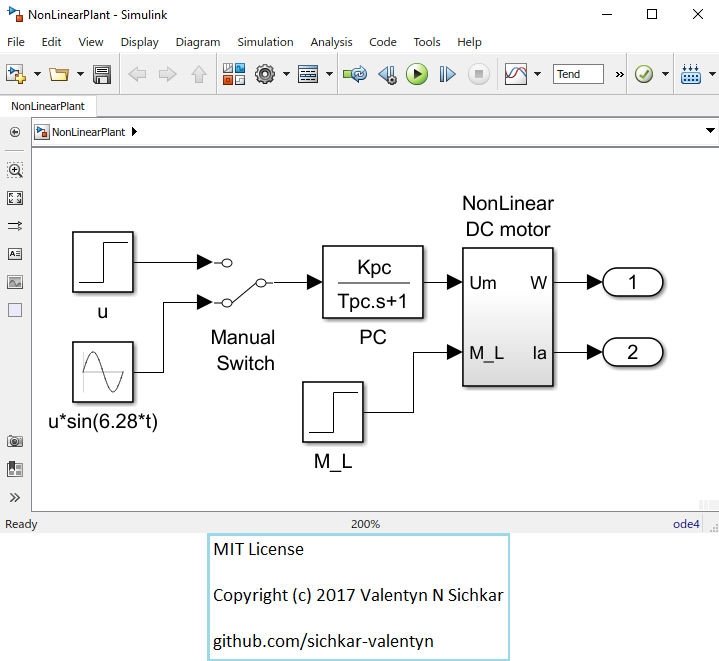

# Analysis of a Nonlinear Electromechanical Plant
Analysis of a Nonlinear Electromechanical Plant in Matlab

### Reference to:
[1] Valentyn N Sichkar. Analysis of a Nonlinear Electromechanical Plant in Matlab Using Simulink Model // GitHub platform [Electronic resource]. URL: https://github.com/sichkar-valentyn/Analysis_of_a_Nonlinear_Electromechanical_Plant (date of access: XX.XX.XXXX)

## Description
Each parameter M_L, dU, Kvf, and Mdf was adjusted separately, and, by doing this, the effect of each parameter on the system can be shown.

## The Matrices for method in Five

## MIT License
## Copyright (c) 2017 Valentyn N Sichkar
## github.com/sichkar-valentyn
### Reference to:
[1] Valentyn N Sichkar. Analysis of a Nonlinear Electromechanical Plant in Matlab Using Simulink Model // GitHub platform [Electronic resource]. URL: https://github.com/sichkar-valentyn/Analysis_of_a_Nonlinear_Electromechanical_Plant (date of access: XX.XX.XXXX)
